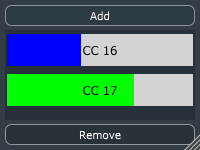

# ShowMIDI_CC

This is a very simple MIDI effect (can be inserted in the MIDI effects slot of Apple Logic Pro X) to visualize MIDI input activity on any number of MIDI CC (continuous controller) dials.

This is intended as a companion to my [ShowMIDI](https://github.com/getdunne/ShowMIDI) plug-in, which visualizes MIDI keyboard, pitch-bend, and mod-wheel activity.

 * Drag resize grip at lower right to resize the GUI
 * Click any CC indicator to put it into "MIDI Learn" mode, then adjust any MIDI CC knob to set
 * Click in blank area to revert out of MIDI Learn mode without changing setting
 * Add button adds a new CC indicator to the bottom of the list
 * Note CC indicator list will be scrollable (scrollbar at right) if there are too many to fit
 * Delete button deletes selected indicator (last one you put in Learn mode) OR last one in the list if nothing selected.

Requires [JUCE 5.x](https://shop.juce.com/get-juce), hence subject to the GNU GPL v3 license. Use the *Projucer* to generate the necessary projects, e.g. VST2 for Windows, Audio Unit for Mac.

If you can't or don't want to build these plug-ins from source, pre-built executables are available in the [Prebuilt folder](Prebuilt).
